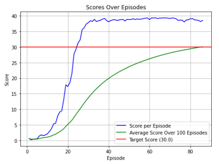

# Project 2: Continuous Control

## Introduction

This project is the second major assignment of the [Deep Reinforcement Learning Nanodegree](https://www.udacity.com/course/deep-reinforcement-learning-nanodegree--nd893) course offered by UDACITY.

It focuses on training an agent to control a double-jointed arm to follow a target location for as long as possible. A reward of +0.1 is awarded for each timestep the hand is in the target location, encouraging the agent to keep the position. The state space includes 33 dimensions representing the arm's position, rotation, velocity, and angular velocities. Each action is a vector with four numbers, corresponding to torque applicable to two joints. Every entry in the action vector should be a number between -1 and 1. 
The agent must learn to generate appropriate torque for the arm's four continuous actions. 
The challenge is considered solved when 20 identical agents (operating in parallel) achieve an average score of +30 over 100 consecutive episodes.


## Setup Instructions

### Prerequisites

- Python 3.6

### Environment Setup

1. Download the Reacher environment compatible with your operating system:
   - Linux: [Download](https://s3-us-west-1.amazonaws.com/udacity-drlnd/P2/Reacher/Reacher_Linux.zip)
   - Mac OSX: [Download](https://s3-us-west-1.amazonaws.com/udacity-drlnd/P2/Reacher/Reacher.app.zip)
   - Windows (32-bit): [Download](https://s3-us-west-1.amazonaws.com/udacity-drlnd/P2/Reacher/Reacher_Windows_x86.zip)
   - Windows (64-bit): [Download](https://s3-us-west-1.amazonaws.com/udacity-drlnd/P2/Reacher/Reacher_Windows_x86_64.zip)
   
   For Windows users unsure of their system type, consult [this guide](https://support.microsoft.com/en-us/help/827218/how-to-determine-whether-a-computer-is-running-a-32-bit-version-or-64). For AWS users planning to train the agent without a virtual screen, use [this version](https://s3-us-west-1.amazonaws.com/udacity-drlnd/P2/Reacher/Reacher_Linux_NoVis.zip).

2. Extract the downloaded environment into the `Project2_Continuous_Control/` directory.

### Repository Setup

Clone the course repository and set up the Python environment:

```bash
# Clone the required repositories
git clone https://github.com/udacity/deep-reinforcement-learning.git
git clone https://github.com/Yoshiokha/Deep_Reinforcement_Learning_Nanodegree_UDACITY/Project2_Continuous_Control.git

# Navigate to the project directory
cd Project2_Continuous_Control

# Create and activate the conda environment
conda create --name DRL_udacity_cpu python=3.6
conda activate DRL_udacity_cpu

# Install PyTorch (Windows specific link provided, for others, visit PyTorch's previous versions page)
pip install https://download.pytorch.org/whl/cpu/torch-0.4.0-cp36-cp36m-win_amd64.whl

# Update unityagents in requirements.txt and install dependencies
pip install -r requirements.txt

# Add the environment to Jupyter
python -m ipykernel install --user --name DRL_udacity_cpu --display-name "Python 3.6 (DRL_udacity_cpu)"
```

## Training the Agent

To start training the agent:

1. Launch Jupyter Notebook by running `jupyter notebook` in your terminal.
2. Open the notebook `Continuous_Control_multi.ipynb`.
3. Update the path to the Reacher environment in the notebook to match your local setup.
4. Execute the notebook cells to begin training the agent.

The training process concludes once the agents achieve an average score of +30 over 100 consecutive episodes, or after 300 episodes, whichever comes first. The models for the actor and critic are saved as `checkpoint_actor.pth` and `checkpoint_critic.pth`, respectively.

## Abstract

This [Report.pdf](./Report.pdf) delineates the process of designing and refining a deep reinforcement learning agent capable of continuous control tasks within the Unity ML-Agents environment. Utilizing the Deep Deterministic Policy Gradient (DDPG) algorithm, the agent was trained to navigate and maintain a double-jointed arm at target locations. 
The evolutionary approach to agent design involved iterative code refinement and testing, resulting in advancements in performance metrics, but addressing one of the limitations of reinforcement learning, which is the instability of learning that can manifest as huge drops in performance, particularly pronounced with DDPG.


